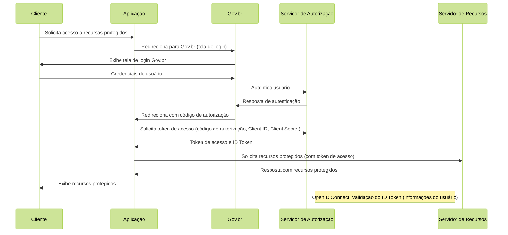

# Proposta de Implementação Farmácia Popular do Brasil Povos Originários

| **PIFPB:**   | 001                                                      |
|--------------|----------------------------------------------------------|
| **Título:**  | Autenticação e autorização para acesso ao Programa FPBPO |
| **Autor:**   | Jessé Azevêdo <jesse.azevedo@saude.gov.br>               |
| **Revisor:** | Michelly Ribeiro <michelly.ribeiro@saude.gov.br>         |
| **Revisor:** | Bruno de Oliveira <bruno.baltazar@saude.gov.br>          |
| **Status:**  | Em validação                                             |
| **Versão:**  | 1.0                                                      |

## Histórico de Revisões

| **Versão** | **Data** | **Autor** | **Descrição** |
| --- | --- | --- | --- |
| 1.0 | 09/02/2025 | Jessé Azevêdo | Criação do documento |

## Resumo

Este documento tem por objetivo descrever o fluxo de autenticação e autorização para acesso ao programa Farmácia Popular do Brasil Povos Originários, bem como os requisitos necessários para a implementação do mesmo.

## Motivação

O Programa Farmácia Popular do Brasil Povos Originários (FPB-PO), é uma aplicação voltada a atender um fluxo específico de atendimentos para o Programa Farmácia Popular do Brasil com foco nas necessidades da saúde indígena.  
Este fluxo possui particularidades intrinsecas ao seu objetivo, havendo múltiplos atores envolvidos e necessidade de controle de acesso e autorização de uso.

## Implementação

O fluxo de autenticação e autorização para acesso ao Programa FPB-PO será implementado utilizando o protocolo OAuth 2.0 e OpenID Connect. Este é um requisito não funcional descrito nas [Diretrizes Arquiteturais do DATASUS](https://wiki-coatic.saude.gov.br/pt-br/desenvolvimento-seguro/dev-seg-cap5).  

O processo de autorização envolve a interação entre um Cliente (aplicação) e o Servidor de Autorização (Gov.br), a interação pode ser resumida em 4 etapas:

1. **Solicitação de autorização:** O cliente solicita autorização ao usuário para acessar recursos protegidos.
2. **Redirecionamento para Gov.br:** O cliente redireciona o usuário para Gov.br para autenticação.
3. **Retorno de código de autorização:** Após a autenticação, Gov.br redireciona o usuário de volta para o cliente com um código de autorização.
4. **Solicitação de token de acesso:** O cliente solicita um token de acesso ao Servidor de Autorização, enviando o código de autorização e suas credenciais.

Abaixo, o diagrama de sequência ilustra o fluxo em questão.


A implementação do fluxo de autorização deverá especificar os recursos que precisarão ser armazenados no banco de dados da aplicação, estes recursos serão passados por meio da _query string_ **scope**. conforme tabela abaixo:

| **Escopo** | **Descrição**                              |
| --- |--------------------------------------------|
| openid | Obrigatório para autenticação              |
| email | E-mail do usuário                          |
| profile | Informações do usuário                     |
| govbr_confiabilidades | Nível de confiabilidade do usuário (selos) |

A aplicação deverá implementar a validação do ID Token, conforme especificado no [OpenID Connect](https://openid.net/specs/openid-connect-core-1_0.html#IDTokenValidation). Uma vez recebida autenticado, a aplicação poderá solicitar recursos protegidos ao Servidor de Recursos, enviando o token de acesso no cabeçalho da requisição. Como resposta, o Servidor de Recursos retornará os recursos solicitados que deverão ser persistidos em banco no primeiro login do usuário na aplicação.

O Gov.Br retornará um objeto com as seguintes informações:

```json
{
        "sub": "(CPF do usuário autenticado.)",
        "amr": ["(Listagem dos fatores de autenticação do usuário com detalhamento. Verificar nas observações para os detalhamentos.)"],
        "picture": "(URL de acesso à foto do usuário cadastrada no Gov.br. A mesma é protegida e pode ser acessada passando o access token recebido.)",
        "name": "(Nome cadastrado no Gov.br do usuário autenticado.)",
        "social_name": "(Nome Social cadastrado no Gov.br do usuário autenticado.Aparecerá apenas se existir no cadastro)",
        "phone_number_verified": "(Confirma se o telefone foi validado no cadastro do Gov.br. Poderá ter o valor "true" ou "false")",
        "phone_number": "(Número de telefone cadastrado no Gov.br do usuário autenticado. Caso o atributo phone_number_verified do ID_TOKEN tiver o valor false, o atributo phone_number não virá no ID_TOKEN)",
        "email_verified": "(Confirma se o email foi validado no cadastro do Gov.br. Poderá ter o valor "true" ou "false")",
        "email": "(Endereço de e-mail cadastrado no Gov.br do usuário autenticado. Caso o atributo email_verified do ID_TOKEN tiver o valor false, o atributo email não virá no ID_TOKEN)",
        "cnpj": "(CNPJ vinculado ao usuário autenticado. Atributo será preenchido quando autenticação ocorrer por certificado digital de pessoal jurídica.)"
}
```

Para recuperar os recursos relacionados a confiabilidade, a aplicação deverá solicitar ao Servidor de Recursos, enviando o token de acesso no cabeçalho da requisição. Como resposta, o Servidor de Recursos retornará os recursos solicitados. Esta chamada deverá ocorrer sempre que o usuário realizar uma autenticação na aplicação, muitos dos recursos da aplicação serão disponibilizados de acordo com o nível de confiabilidade do usuário. Abaixo retorno do Servidor de Recursos:

```json
[
        {
                "id": "1 (Bronze)",
                "dataAtualizacao": "(Mostra a data e hora que ocorreu atualização da categoria na conta do usuário. A mascará será YYYY-MM-DD HH:MM:SS)"
        },

        {
                "id": "2 (Prata)",
                "dataAtualizacao": "(Mostra a data e hora que ocorreu atualização da categoria na conta do usuário. A mascará será YYYY-MM-DD HH:MM:SS)"
        },

        {
                "id": "3 (Ouro)",
                "dataAtualizacao": "(Mostra a data e hora que ocorreu atualização da categoria na conta do usuário. A mascará será YYYY-MM-DD HH:MM:SS)"
        }
]
```
## Critérios de Aceitação

- A aplicação deverá implementar o fluxo de autorização utilizando OAuth 2.0 e OpenID Connect.
- A aplicação deverá implementar a validação do ID Token.
- A aplicação deverá persistir os recursos retornados pelo Servidor de Recursos.
- Ao logar pela primeira vez, o usuário deverá complementar seu cadastro, informando dados adicionais conforme título Modelo de Dados, descrito abaixo.
- A cada execução do fluxo de autenticação/autorização, a aplicação deverá verificar se houve atualização no cadastro do usuário, atualizando dados cadastrais pertinentes.
- A aplicação deverá implementar a solicitação de recursos de confiabilidade ao Servidor de Recursos.
- A cada execução do fluxo de autenticação/autorização, a aplicação deverá verificar o retorno do nível de confiabilidade do usuário, a aplicação deverá reagir aos níveis de confiabilidade definidos e conjunto de permissões atribuidas ao usuário.

## Modelo de Dados

| Nível | Atributo        | Descrição                                                                    | Cardinalidade | Tipo de Dado | Tamanho | Formato         |
| :--- |:----------------|:-----------------------------------------------------------------------------|:--------------|:-------------|:--------|:----------------|
| 1 | Identificador   | Código sequencial que identifica univocamente um usuário no âmbito do FPB-PO | (1, 1)        | number | -       | -               |
| 1 | Nome            | Nome do usuário                                                              | (1, 1)        | string | 100     | -               |
| 1 | Nome Social     | Nome Social cadastrado no Gov.br do usuário autenticado.                     | (0, 1)        | string | 100     | -               |
| 1 | E-mail          | E-mail do usuário                                                            | (1, 1)        | string | 100     | e-mail          |
| 1 | CPF             | CPF do usuário                                                               | (1, 1)        | string | 11      | CPF             |
| 1 | Telefone        | Telefone do usuário                                                          | (0, 1)        | string | 15      | (xx) xxxxx-xxxx |
| 1 | Endereço        | Endereço do usuário                                                          | (1, 1)        | string | 100     | -               |
| 1 | Número          | Número do endereço                                                           | (1, 1)        | string | 10      | -               |
| 1 | Complemento     | Complemento do endereço                                                      | (0, 1)        | string | 100     | -               |
| 1 | Bairro          | Bairro do endereço                                                           | (1, 1)        | string | 100     | -               |
| 1 | Cidade          | Cidade do endereço                                                           | (1, 1)        | string | 100     | -               |
| 1 | UF              | Estado do endereço                                                           | (1, 1)        | string | 2       | -               |
| 1 | CEP             | CEP do endereço                                                              | (1, 1)        | string | 8       | -               |

OBS: 

1. O campo **Nome Social** será exibido apenas se existir no cadastro do usuário.
2. UF, Bairro, Estado e Cidade deverão ser preenchidos automaticamente a partir do CEP informado pelo usuário, e deverá ser consumido na DBGERAL do MS.

## Elementos de Interface

Abaixo, o protótipo de tela para o fluxo de autenticação e autorização e cadastro complementar do usuário.

[Protótipos Farmácia Popular do Brasil Povos Originários](https://xd.adobe.com/view/10b5d8c8-f99d-4e67-ae0d-461860c55301-45e6/)
