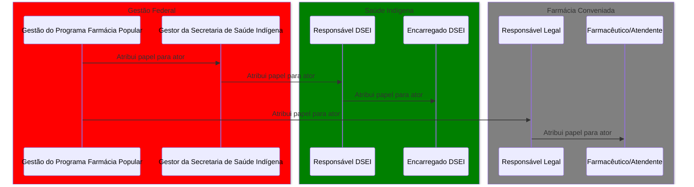
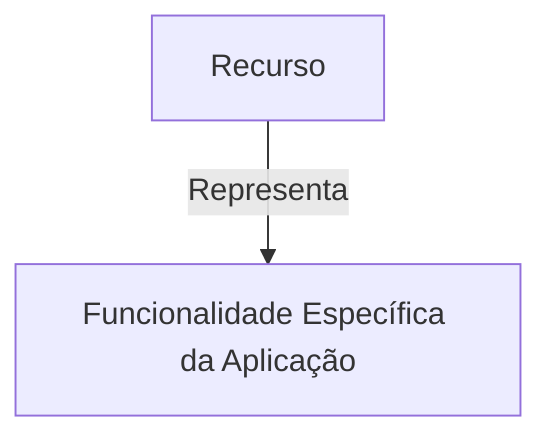
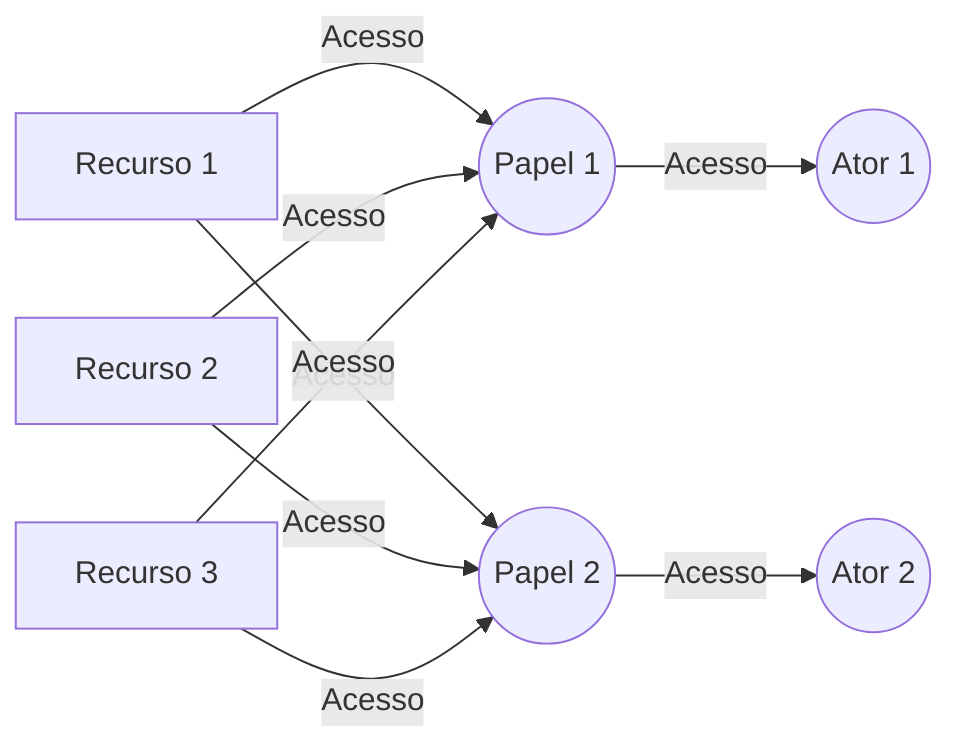
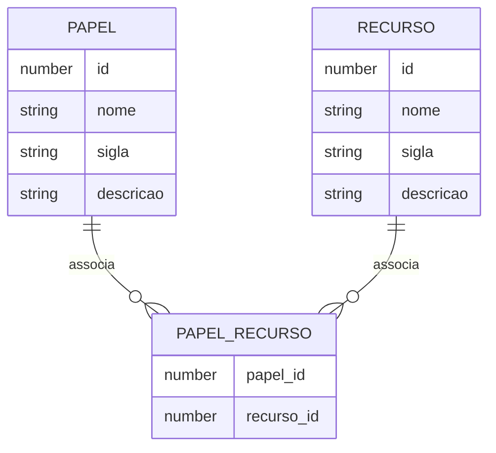

# Proposta de Implementação Farmácia Popular do Brasil Povos Originários

| **PIFPB:**   | 002                                                          |
|--------------|--------------------------------------------------------------|
| **Título:**  | Papéis desempenhados pelos atores dentro da aplicação FPB-PO |
| **Autor:**   | Jessé Azevêdo <jesse.azevedo@saude.gov.br>                   |
| **Revisor:** | Michelly Ribeiro <michelly.ribeiro@saude.gov.br>             |
| **Revisor:** | Bruno de Oliveira <bruno.baltazar@saude.gov.br>              |
| **Status:**  | Em validação                                                 |
| **Versão:**  | 1.0                                                          |

## Histórico de Revisões

| **Versão** | **Data**   | **Autor**     | **Descrição** |
| --- |------------|---------------|----------------------|
| 1.0 | 15/02/2025 | Jessé Azevêdo | Criação do documento |

## Resumo

Este documento tem por objetivo especificar o conjunto de papéis que poderão ser atribuídos a atores no âmbito do programa Farmácia Popular do Brasil Povos Orginários.

## Motivação

O Programa Farmácia Popular do Brasil Povos Originários (FPB-PO), é uma aplicação voltada a atender um fluxo específico de atendimento para o Programa Farmácia Popular do Brasil com foco nas necessidades da saúde indígena.  
Para a execução do fluxo de atendimento da população indígena, é necessário que a aplicação FPB-PO possua um rígido controle de perrmissões, de forma a autorizar o acesso a recursos conforme o papel que cada ator desempenha no âmbito da aplicação. Neste sentido, é possível encontrar 6 papéis distintos, organizados conforme em 3 grupos a saber:

1. **Gestão do programa:** Conjunto de papéis atribuídos no âmbito da Gestão Federal. Subdivide-se em dois conjuntos de recursos:
    - **Gestão do Programa Farmácia Popular:** Responsável pela coordenação do programa em âmbito Federal, possuindo privilégios administrativos dentro da aplicação.
    - **Gestor da Secretaria de Saúde Indígena:** Responsável pela gestão dos atores designados em DSEI's e com acesso a relatórios de conhecimento geral.
2. **Saúde Indígena:** Conjunto de papéis atribuídos no âmbito dos DSEI's (Distritos Sanitários Especiais Indígenas). Subdivide-se em dois conjuntos de recursos:
    - **Responsável DSEI:** Responsável pela inclusão das solicitações de medicamentos, busca dos mesmos em farmácias conveniadas ao programa e responsável pelo registro de dispensação do medicamento em questão.
    - **Encarregado DSEI:** Papel atribuído pelo Responsável DSEI, poderá fazer a busca do medicamento na farmácia conveniada ao programa.
3. **Farmácia Conveniada:** Conjunto de papéis atribuídos a atores no âmbito das farmácias conveniadas ao programa, responsável pela entrega do medicamento ao Responsável DSEI ou Encarregado DSEI. Subdivide-se em dois conjuntos de recursos:
    - **Responsável Legal:** Responsável legal da Farmácia/Drogaria conveniada ao Programa Farmácia Popular para atender os Povos Originários. Poderá atribuir o papel de Farmacêutico/Atendente a quaisquer atores.
    - **Farmacêutico/Atendente:** Responsável pelo registro do atendimento da solicitação realizada pelo DSEI.

Cada um dos papéis em questão possuem um conjunto de recursos específicos, compreendendo o conjunto de features que cada ator poderá acessar dentro da aplicação.

## Implementação

Cada papel deverá estar vinculado a um conjunto recursos. Um recurso representa uma funcionalidade específica da aplicação, que poderá ser acessada por um ou mais papéis.

Os recursos vinculados deverão estar vinculados a um papel. Esta associação deverá ser implementada de forma a garantir a segregação de privilégios, garantindo que cada ator tenha acesso apenas aos recursos que lhe são permitidos. É importante pontuar que um recurso poderá ser acessado por mais de um papel, e um papel poderá ter acesso a mais de um recurso.

## Critérios de Aceitação

- A aplicação deverá manter a lista de papéis e recursos associados aos mesmo.
- Um papel está associado a um conjunto de recursos.
- Um recurso representa um conjunto de funcionalidades específicas da aplicação.
- Um recurso poderá estar associado a mais de um papel.
- Um papel poderá ter acesso a mais de um recurso.

## Modelo de Dados

Modelo de Dados para papéis da aplicação FPB-PO.

| Nível | Atributo               | Descrição                                                                  | Cardinalidade | Tipo de Dado | Tamanho | Formato         |
| :--- |:-----------------------|:---------------------------------------------------------------------------|:--------------|:-------------|:--------|:----------------|
| 1 | Identificador do papel | Código sequencial que identifica univocamente um papel no âmbito do FPB-PO | (1, 1)        | number | -       | -               |
| 1 | Papel                  | Nome do papel                                                              | (1, 1)        | string | 25      | -               |
| 1 | Sigla Papel            | Sigla do papel                                                             | (1, 1)        | string | 8       | -               |
| 1 | Descrição              | Breve descrição do papel no âbito da aplicação                             | (1, 1)        | string | 100     | e-mail          |

Modelo de Dados para recursos da aplicação FPB-PO.

| Nível | Atributo               | Descrição                                                                  | Cardinalidade | Tipo de Dado | Tamanho | Formato         |
| :--- |:-----------------------|:---------------------------------------------------------------------------|:--------------|:-------------|:--------|:----------------|
| 1 | Identificador do recurso | Código sequencial que identifica univocamente um recurso no âmbito do FPB-PO | (1, 1)        | number | -       | -               |
| 1 | Recurso                | Nome do recurso                                                            | (1, 1)        | string | 25      | -               |
| 1 | Descrição              | Breve descrição do recurso no âbito da aplicação                           | (1, 1)        | string | 100     | e-mail          |
| 1 | Sigla do Recurso       | Sigla do recurso                                                           | (1, 1)        | string | 8       | -               |

Diagrama de Entidade e Relacionamento

## Elementos de Interface

Este documento não contempla elementos de interface.
