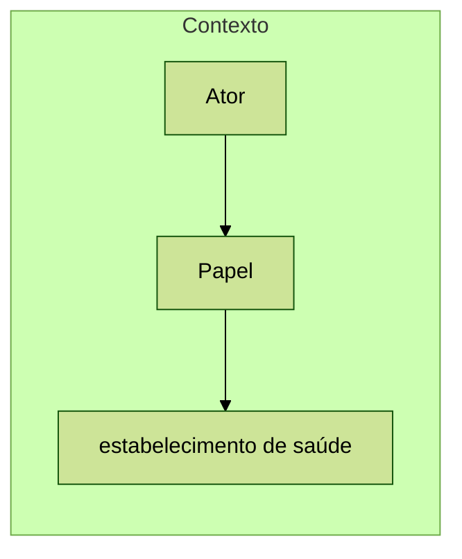
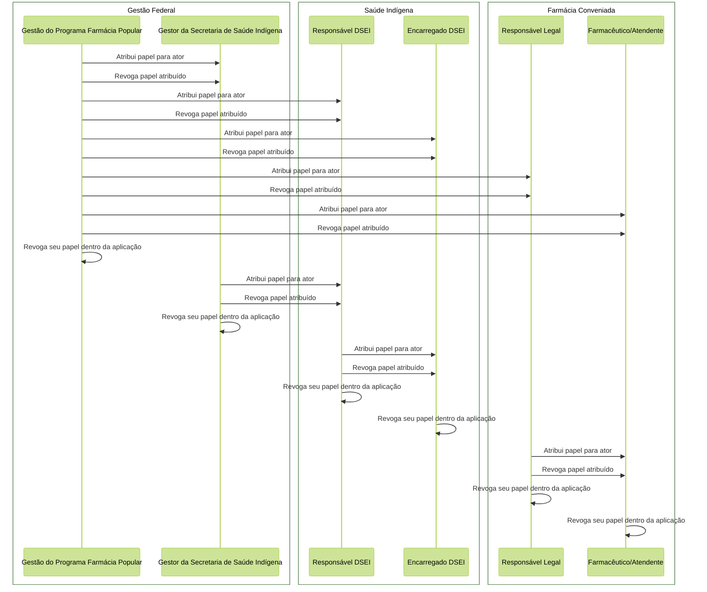
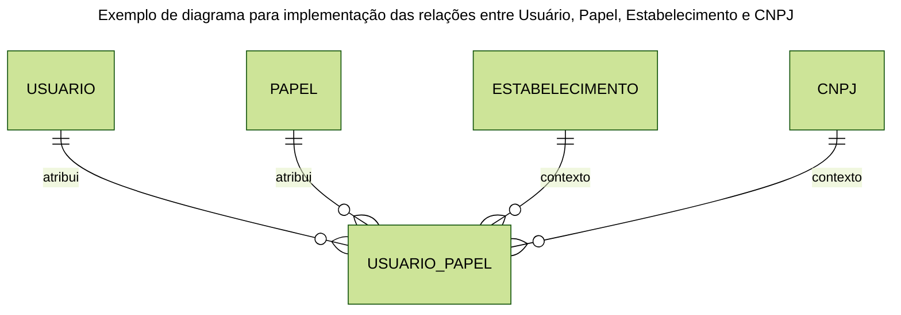

# Proposta de Implementação Farmácia Popular do Brasil Povos Originários

| **PIFPB:**   | 003                                              |
|--------------|--------------------------------------------------|
| **Título:**  | Gestão de papéis e permissão de acesso no FPBPO  |
| **Autor:**   | Jessé Azevêdo <jesse.azevedo@saude.gov.br>       |
| **Revisor:** | Michelly Ribeiro <michelly.ribeiro@saude.gov.br> |
| **Revisor:** | Bruno de Oliveira <bruno.baltazar@saude.gov.br>  |
| **Status:**  | Em validação                                     |
| **Versão:**  | 1.0                                              |

## Histórico de Revisões

| **Versão** | **Data**   | **Autor**     | **Descrição**                                |
| --- |------------|---------------|-----------------------------------------------------|
| 1.0 | 15/02/2025 | Jessé Azevêdo | Criação do documento                                |
| 1.1 | 19/05/2024 | Jessé Azevêdo | Edição de regras e diagrama de atribuição de papéis |

## Resumo

O Documento [PIFPBPO002](./PIFPBPO002.md) define papéis que poderão ser desempenhados por um ator no âmbito da aplicação. Este documento tem por objetivo detalhar a implementação da gestão de papéis e permissão de acesso no Programa Farmácia Popular do Brasil Povos Originários (FPB-PO).

## Motivação

A aplicação Programa Farmácia Popular do Brasil Povos Originários (FPB-PO), precisa possuir um rígido controle de perrmissões, de forma a autorizar o acesso a recursos conforme o papel que cada ator desempenha no âmbito da aplicação. No documento [PIFPBPO002](./PIFPBPO002.md) foram definidos 6 papéis distintos, organizados em 3 grupos. No entanto, é necessário detalhar a implementação da gestão de papéis e permissão de acesso no FPB-PO. 
Este documento traz detalhes sobre a implementação do controle de acesso, que será realizado por meio de um sistema de autorização baseado em funções (Role-Based Access Control - RBAC).

## Implementação

Para a implementação, trabalharemos o conceito de RBAC, onde cada papel desempenhado por um ator na aplicação, terá um conjunto de permissões associadas. As permissões são atribuídas a papéis, e os papéis são atribuídos a atores. A aplicação deverá implementar um sistema de autorização baseado em funções, onde cada ator terá um papel associado, e cada papel terá um conjunto de permissões associadas.

A atribuição de um papel por si só pode não ser suficiente para que o ator realize suas operações. Alguns dos grupos de papéis da aplicação precisam estar atrelados a um estabelecimento de saúde (DSEI) ou a uma farmácia conveniada ao programa a esta associação entre estabelecimento de saúde (incluindo aqui as farmácias conveniadas) e o papel atribuido ao ator, chamamos de **contexto**.

Os papeis vinculados a Gestão Federal não possuem contexto, pois são atribuídos diretamente ao ator e não necessitam de um estabelecimento de saúde para sua atuação.

A gestão de papéis e permissões de acesso respeitará um conjunto de regras específicas e utilizará apenas o conceito de **atribuição**. Em resumo, um papel é atribuído a um ator por outro ator que possua privilégios para tal. Cada ator poderá possuir um ou mais papéis dentro da aplicação.

Uma vez atribuído um papel, o ator poderá acessar os recursos da aplicação conforme as permissões associadas ao papel. O ator no entando poderá remover um papel atribuído a si mesmo, bem como um ator com um papel que tenha privilégios poderá revogar a atribuição a qualquer momento.

## Critérios de Aceitação

- A aplicação deverá possuir um sistema de autorização baseado em funções (RBAC).
- Papéis relacionados a Gestão Federal não precisam de um contexto para garantir sua plena atuação na aplicação.
- Papéis relacionados a Saúde Indígena e precisam estar atrelados a um estabelecimento de saúde (DSEI).
- Papéis relacionados a Farmácia/Drogaria conveniada ao programa precisam estar atrelados a uma CNPJ devidamente credenciado.
- O papel "Gestão do Programa Farmácia Popular" só poderá ser atribuído por um ator com o mesmo papel.
- O papel "Gestor da Secretaria de Saúde Indígena" poderá ser atribuído por um ator com o papel "Gestão do Programa Farmácia Popular" e "Gestor da Secretaria de Saúde Indígena".
- O papel "Responsável DSEI" poderá ser atribuído por um ator com o papel "Gestor da Secretaria de Saúde Indígena" e "Gestão do Programa Farmácia Popular".
- O papel "Encarregado DSEI" poderá ser atribuído por um ator com o papel "Responsável DSEI" e "Gestão do Programa Farmácia Popular".
- O papel "Responsável Legal" só poderá ser atribuído por um ator com o papel "Gestão do Programa Farmácia Popular".
- O papel "Farmacêutico/Atendente" poderá ser atribuído por um ator com o papel "Responsável Legal" e "Gestão do Programa Farmácia Popular".
- Um ator poderá possuir mais de um papel dentro da aplicação.
- Um ator poderá remover um papel atribuído a si.
- Um ator com um papel que tenha privilégios para conceder um papel a outro ator poderá revogar o mesmo conjutno de papéis ao qual possui privilégios de atribuir.
- Todo o fluxo de atribuição e revogação de papéis deverá ser registrado em tabela de auditoria.
- Um ator só pode ter um único papel ativo por contexto.

## Modelo de Dados

| Nível | Atributo                         | Descrição                                                                  | Cardinalidade | Tipo de Dado | Tamanho | Formato            | Observação                                                                                  |
|:------|:---------------------------------|:---------------------------------------------------------------------------|:--------------|:-------------|:--------|:-------------------|:--------------------------------------------------------------------------------------------|
| 1     | CPF do usuário                   | CPF do usuário                                                             | (1, 1)        | string       | -       | -                  | -                                                                                           |
| 1     | Identificador do Papel           | Código sequencial com identificador do papel                               | (1, 1)        | number       | -       | -                  | -                                                                                           |
| 1     | Identificador do Estabelecimento | Código sequencial com identificador do estabelecimento                     | (0, 1)        | number       | -       | -                  | Atribuido apenas ao grupo de papéis relacionados a Saúde Indígena                           |
| 1     | CNPJ                             | Número de inscrição no CNPJ do estabelecimento                             | (0, 1)        | string       | 14      | 00.000.000/0000-00 | Atribuido apenas ao grupo de papéis relacionados a Farmácia/Drogaria conveniada ao programa |
| 1     | Data de Atribuição               | Data em que o papel foi atribuído ao usuário                               | (1, 1)        | date         | -       | dd/mm/yyyy         | -                                                                                           |
| 1     | Data de Revogação                | Data em que o papel foi revogado do usuário                                | (0, 1)        | date         | -       | dd/mm/yyyy         | -                                                                                           |
| 1     | Atribuído por                    | Identificador do usuário que atribuiu o papel                              | (1, 1)        | number       | -       | -                  | -                                                                                           |
| 1     | Revogado por                     | Identificador do usuário que revogou o papel                               | (0, 1)        | number       | -       | -                  | -                                                                                           |
| 1     | Status                           | Campo enumerado que identifica se o papel atribuído está ativo ou revogado | (1, 1)        | string       | 1       | A/R                | -                                                                                           |

## Elementos de Interface

Abaixo, o protótipo de tela para o fluxo de atribuição de papéis.

[Protótipos Farmácia Popular do Brasil Povos Originários](https://xd.adobe.com/view/10b5d8c8-f99d-4e67-ae0d-461860c55301-45e6/screen/1baa9665-1577-4ef6-873b-56e821a5ed85/?fullscreen)
