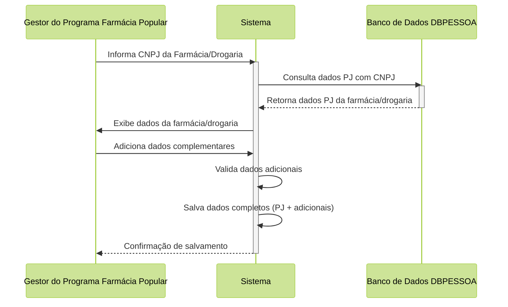
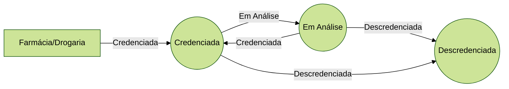
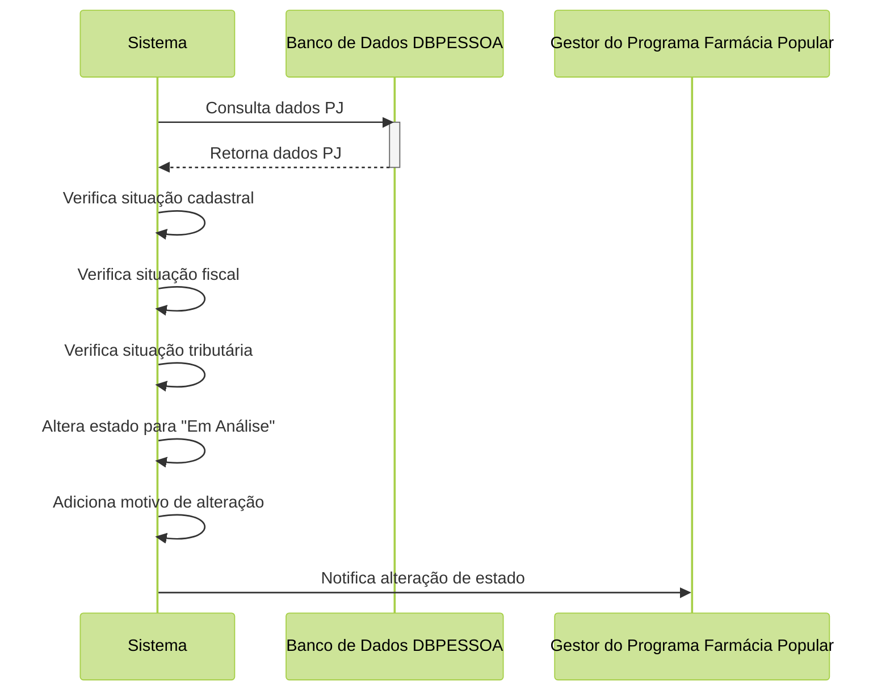

# Proposta de Implementação Farmácia Popular do Brasil Povos Originários

| **PIFPB:**   | 004                                                    |
|--------------|--------------------------------------------------------|
| **Título:**  | Gestão de Farmácias/Drogarias Credenciadas ao Programa |
| **Autor:**   | Jessé Azevêdo <jesse.azevedo@saude.gov.br>             |
| **Revisor:** | Michelly Ribeiro <michelly.ribeiro@saude.gov.br>       |
| **Revisor:** | Bruno de Oliveira <bruno.baltazar@saude.gov.br>        |
| **Status:**  | Em validação                                           |
| **Versão:**  | 1.0                                                    |

## Histórico de Revisões

| **Versão** | **Data**   | **Autor**     | **Descrição** |
| --- |------------|---------------|----------------------|
| 1.0 | 23/02/2025 | Jessé Azevêdo | Criação do documento |

## Resumo

Este documento tem por objetivo especificar detalhes da manutenção e credenciamento de uma farmácia ou drogaria ao programa programa Farmácia Popular do Brasil Povos Orginários.

## Motivação

O Programa Farmácia Popular do Brasil Povos Originários (FPB-PO), é uma aplicação voltada a atender um fluxo específico de atendimento para o Programa Farmácia Popular do Brasil com foco nas necessidades da saúde indígena.  

Uma etapa crucial para viabilizar o atendimento diz respeito ao credenciamento de farmácias e drogarias ao programa e o controle da participação destas no programa.  

Cada farmácia passa por análises que ocorrem após uma venda de medicamentos para a população indígena, onde são avaliados critérios que podem alterar o estado de uma farmácia/drogaria credenciada ao programa. A aplicação deve permitir ao gestor do programa a alteração do estado de uma farmácia livremente mediante justificativa e motivação técnica adequada.  

Além do exposto, há de se convir que o credenciamento de uma farmácia se dá com o objetivo de atender uma necessidade expressa pela administração pública mediante edital de credenciamento, onde são estabelecidos critérios e condições para a participação de farmácias/drogarias no programa. Assim, é necessário manter um controle rígido do histórico de credenciamento de uma farmácia/drogaria credenciada, mantendo informações como endereço e contato da farmácia/drogaria, data de credenciamento, data de descredenciamento ou quaisquer alterações no registro da farmácia/drogaria.

## Implementação

O recurso manter farmácia/drogaria credenciada deve estar disponível apenas para atores com o papel "Gestor do Programa Farmácia Popular" devidamente ativo, permitindo a manutenção dos dados de uma farmácia/drogaria credenciada ao programa.

Ao cadastrar uma nova farmácia/drogaria credenciada, o sistema deverá consumir os dados da base de dados de Pessoa Jurídica presente em DBPESSOA e complementar com dados de Geolocalização, como latitude e longitude, para facilitar a localização da farmácia/drogaria no mapa.

Cada farmácia/drogaria possui um estado que identifica se a mesma está apta a atender a população indígena no contexto do programa. Os estados possíveis são: credenciada, descredenciada e em análise. Podendo haver uma livre alternância estre estes estados. Farmácias/Drogarias cujo estado seja igual a descredenciada não poderão atender a população indígena, além disso, aquelas em estado "em análise" ficam temporariamento suspensas de participar do programa até que o estado seja alterado para "credenciada". Além disso, é necessário manter um rigído controle do histórico de credenciamento de uma farmácia/drogaria credenciada, mantendo informações como endereço e contato da farmácia/drogaria, data de credenciamento, data de descredenciamento ou quaisquer alterações no registro da farmácia/drogaria.

O Sistema deverá consultar a base de pessoa jurídica mensalmente para verificar a situação cadastral da farmácia/drogaria credenciada, e caso a mesma não seja encontrada, esteja irregular junto a Receita Federal ou tenha seus dados cadastrais alterados, o sistema deverá alterar o estado da farmácia/drogaria para "em Análise", para que um ator com papel Gestor do Programa Farmácia Popular possa avaliar a situação e tomar as devidas providências.

## Critérios de Aceitação

- A aplicação deverá manter a relação de farmácias/drogarias credenciadas ao programa.
- Os dados do CNPJ credenciado deverá ser oriundo da DBPESSOA.
- Dados deverão ser atualizados mensalmente em consulta à DBPESSOA.
- Qualquer alteração realizada no cadastro da farmácia credenciada deverá ser registrada no histórico.
- O estado da farmácia credenciada deverá ser alterado para "Em Análise" caso a mesma não seja encontrada na DBPESSOA.
- O estado da farmácia credenciada deverá ser alterado para "Em Análise" caso a mesma esteja irregular junto a Receita Federal.
- O estado da farmácia credenciada deverá ser alterado para "Em Análise" caso a mesma tenha seus dados cadastrais alterados.
- Apenas atores com papel "Gestor do Programa Farmácia Popular" poderão alterar o estado de uma farmácia credenciada.
- Sempre que o sistema mude o estado de uma farmácia credenciada, o mesmo deverá registrar o motivo da alteração que poderá ser "Mudança de dados cadastrais", "Farmácia/Drograria credenciada está irregular com Receita Federal".
- Alterações de estado realizadas pelo Gestor do Programa Farmácia Popular deverão ser justificadas e registradas no histórico da farmácia credenciada.
- O sistema deverá notificar o Gestor do Programa Farmácia Popular sempre que uma farmácia credenciada tiver seu estado alterado.
- O sistema deverá manter um histórico de alterações de estado de uma farmácia credenciada com uma réplica de todos os dados anteriores.
- A tela "Manter Farmácia/Drogaria Credenciada" deverá permitir a visualização da relação de Responsáveis legais incritos no estabelecimento.
- Deverá ser possível ao ator com papel "Gestor do Programa Farmácia Popular" visualizar o histórico de alterações de uma farmácia/drogaria credenciada ao programa.

## Modelo de Dados

Modelo de Dados para papéis da aplicação FPB-PO.

| Nível | Atributo                     | Descrição                                                             | Cardinalidade | Tipo de Dado | Tamanho | Formato           |
|:------|:-----------------------------|:----------------------------------------------------------------------|:--------------|:-------------|:--------|:------------------|
| 1     | CNPJ                         | Cadastro do credenciado na Base Nacional de Pessoas Jurídicas         | 1..1          | string       | 14      | xx.xxxxxx/xxxx-xx |
| 1     | Razão Social                 | Razão Social do estabelecimento credenciado                           | 1..1          | string       | 100     |                   |
| 1     | Nome Fantasia                | Nome Fantasia do estabelecimento credenciado                          | 1..1          | string       | 100     |                   |
| 1     | CNPJ Matriz                  | CNPJ da matriz do estabelecimento credenciado                         | 1..1          | string       | 14      | xx.xxxxxx/xxxx-xx |
| 1     | Endereço                     | Endereço do estabelecimento credenciado                               | 1..1          | string       | 100     |                   |
| 1     | Bairro                       | Bairro do estabelecimento credenciado                                 | 1..1          | string       | 50      |                   |
| 1     | CEP                          | CEP do estabelecimento credenciado                                    | 1..1          | string       | 8       | xxxxx-xxx         |
| 1     | Cidade                       | Cidade do estabelecimento credenciado                                 | 1..1          | string       | 50      |                   |
| 1     | UF                           | UF do estabelecimento credenciado                                     | 1..1          | string       | 2       |                   |
| 1     | Telefone                     | Telefone do estabelecimento credenciado                               | 1..1          | string       | 15      | (xx) xxxx-xxxx    |
| 1     | E-mail                       | E-mail do estabelecimento credenciado                                 | 1..1          | string       | 100     |                   |
| 1     | Latitude                     | Latitude do estabelecimento credenciado                               | 1..1          | string       | 20      |                   |
| 1     | Longitude                    | Longitude do estabelecimento credenciado                              | 1..1          | string       | 20      |                   |
| 1     | Licença                      | Número da licença sanitária do estabelecimento credenciado            | 1..1          | string       | 20      |                   |
| 1     | Data de expiração da licença | Data de expiração da licença sanitária do estabelecimento credenciado | 1..1          | date         | -       | dd/mm/yyyy        |
| 1     | Estado                       | Estado atual do estabelecimento credenciado                           | 1..1          | string       | 20      |                   |
| 1     | Motivo                       | Motivo da alteração de estado do estabelecimento credenciado          | 1..1          | string       | 100     |                   |

## Elementos de Interface

Em desenvolvimento.
