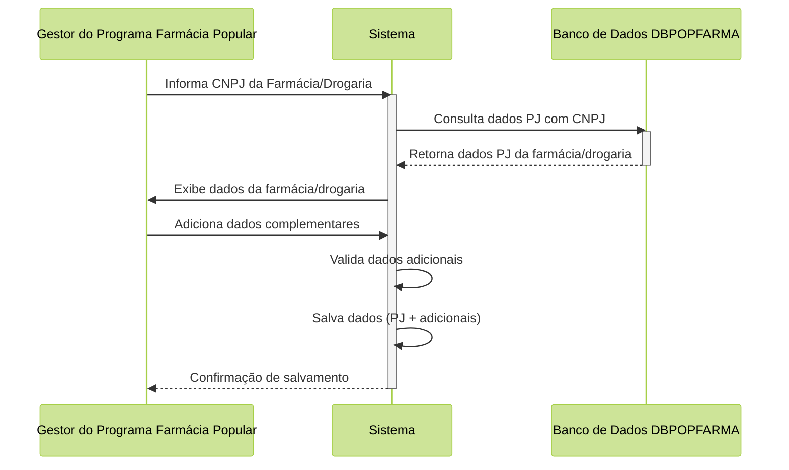

# Proposta de Implementação Farmácia Popular do Brasil Povos Originários

| **PIFPB:**   | 004                                                    |
|--------------|--------------------------------------------------------|
| **Título:**  | Gestão de Farmácias/Drogarias Credenciadas ao Programa |
| **Autor:**   | Jessé Azevêdo <jesse.azevedo@saude.gov.br>             |
| **Revisor:** | Michelly Ribeiro <michelly.ribeiro@saude.gov.br>       |
| **Revisor:** | Bruno de Oliveira <bruno.baltazar@saude.gov.br>        |
| **Status:**  | Validado                                               |
| **Versão:**  | 1.1                                                    |

## Histórico de Revisões

| **Versão** | **Data**   | **Autor**        | **Descrição**                                  |
|------------|------------|------------------|------------------------------------------------|
| 1.0        | 23/02/2025 | Jessé Azevêdo    | Criação do documento                           |
| 1.1        | 10/03/2025 | Michelly Ribeiro | Revisão e validação do documento               |
| 1.2        | 27/05/2025 | Jessé Azevêdo    | Adição de regras para habilitação de drogarias |

## Resumo

Este documento tem por objetivo especificar detalhes da manutenção e adesão de uma farmácia ou drogaria ao programa na modalidade de atendimento aos Povos Originários.

## Motivação

O Programa Farmácia Popular do Brasil Povos Originários (FPB-PO), é uma aplicação voltada a atender um fluxo específico de atendimento para o Programa Farmácia Popular do Brasil com foco nas necessidades da saúde indígena.  

Uma etapa crucial para viabilizar o atendimento diz respeito ao credenciamento de farmácias e drogarias ao programa e o controle da participação destas no mesmo. O credenciamento é o processo pelo qual, mediante Edital de Convocação, a administração pública seleciona farmácias e drogarias para adequarem-se às condições estabelecidas para fornecimento de medicamentos e correlatos nos termos da Portaria de Consolidação Nº 5, de 28 de Setembro de 2017, Seção VII.

Uma vez apta, a farmácia ou drogaria credenciada, mediante a expresso interesse da administração pública, poderá aderir a modalidade de atendimento aos Povos Originário por meio de seleção específica. As farmácias e drogarias selecionadas deverão ser controladas no âmbito da aplicação FPB-PO, que manterá a relação de farmácias e drogarias credenciadas e aptas a atender a população indígena.  

É importante pontuar que a manutenção da relação de farmácias e drogarias credenciadas ao programa é uma atividade exclusiva do Gestor do Programa Farmácia Popular, que deverá manter atualizada a relação de farmácias e drogarias credenciadas, bem como controlar a participação destas no programa. Além disso, o sistema deverá manter um histórico de alterações de estado de uma farmácia credenciada, registrando todas as alterações realizadas no cadastro da farmácia credenciada. Outrossim, a aptidão a participar de evento de sorteio para atendimentos aos Povos Originários, de qual tratará documento específico, depende de seu estado no âmbito do esquema de banco DBPOPFARMA e de seu estdo Fiscal e Cadastral junto a Receita Federal conforme consulta no momento ao esquema de banco de dados DBPESSOA.

## Implementação

O recurso manter adesão de farmácia/drogaria credenciada a modalidade de atendimento Povos Originários deve estar disponível apenas para atores com o papel "Gestor do Programa Farmácia Popular" devidamente ativo, permitindo ação de inclusão e edição de uma farmácia/drogaria credenciada no Programa Farmácia Popular do Brasil.

Ao habilitar uma nova farmácia/drogaria credenciada, o sistema deverá consumir os dados da base de dados de Pessoa Jurídica presente em DBPOPFARMA e complementar com dados de Geolocalização, como latitude e longitude, para facilitar a localização da farmácia/drogaria no mapa.

## Critérios de Aceitação

- A aplicação deverá manter a relação de farmácias/drogarias credenciadas ao programa aptas a atendimento na modalidade Povos Originários.
- Apenas farmácias credenciadas ao programa e ativas no esquema DBPOPFARMA estão aptas a aderir à modalidade de atendimento aos Povos Originários.
- Qualquer alteração realizada no status de adesão a modalidade de atendimento aos Povos Originários da farmácia/drogaria credenciada deverá ser registrada em histórico.
- Apenas atores com papel "Gestor do Programa Farmácia Popular" poderão alterar o dados de adesão a modalidade Atendimento aos Povos Originários de uma farmácia credenciada.
- Alterações de estado realizadas pelo Gestor do Programa Farmácia Popular deverão ser justificadas e registradas no histórico da farmácia credenciada.
- A tela "Manter Farmácia/Drogaria Credenciada" deverá permitir a visualização da relação de Responsáveis legais incritos no estabelecimento.
- Deverá ser possível ao ator com papel "Gestor do Programa Farmácia Popular" visualizar o histórico de alterações de uma farmácia/drogaria credenciada ao programa.

## Modelo de Dados

Modelo de Dados para papéis da aplicação FPB-PO.

| Nível | Atributo                     | Descrição                                                                    | Cardinalidade | Tipo de Dado | Tamanho | Formato                  |
|:------|:-----------------------------|:-----------------------------------------------------------------------------|:--------------|:-------------|:--------|:-------------------------|
| 1     | CNPJ                         | Cadastro do credenciado na Base Nacional de Pessoas Jurídicas                | 1..1          | string       | 14      | xx.xxxxxx/xxxx-xx        |
| 1     | Id Farmácia Credenciada      | Identificador da farmácia/drogaria no esquema DBPOPFARMA                     | 1..1          | integer      | -       |                          |
| 1     | Latitude                     | Latitude do estabelecimento credenciado                                      | 0..1          | string       | 20      |                          |
| 1     | Longitude                    | Longitude do estabelecimento credenciado                                     | 0..1          | string       | 20      |                          |
| 1     | Data Adesão                  | Data em que a farmácia credenciada aderiu à modalidade de atendimento aos PO | 1..1          | date         | -       | dd/mm/yyyy               |
| 1     | Estado                       | Estado atual de adesão à modalidade de atendimento aos PO                    | 1..1          | string       | 1       | A - Ativo / I  - Inativo |

## Elementos de Interface

Em desenvolvimento.
