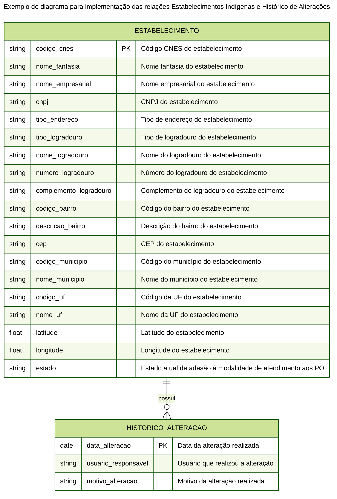
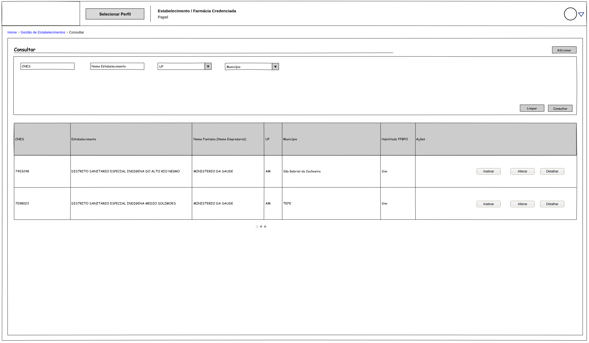
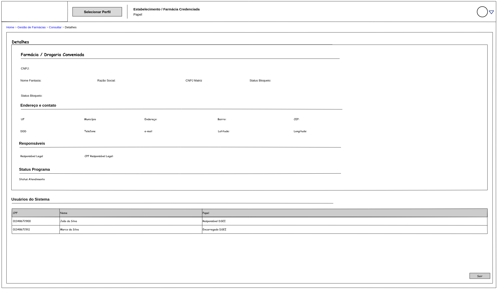
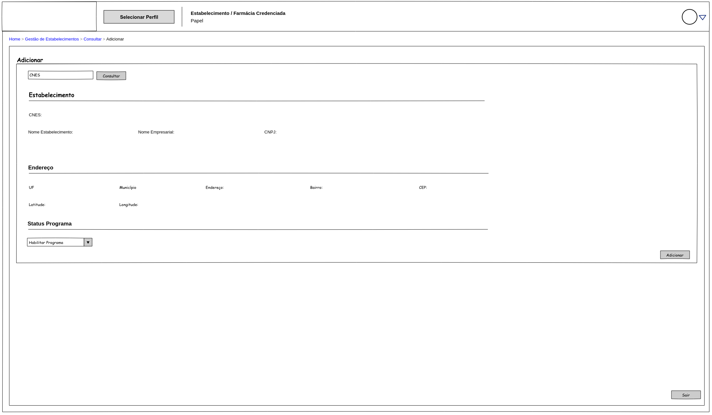

# Proposta de Implementação Farmácia Popular do Brasil Povos Originários

| **PIFPB:**   | 005                                                            |
|--------------|----------------------------------------------------------------|
| **Título:**  | Gestão de Estabelecimentos indígenas participantes do programa |
| **Autor:**   | Jessé Azevêdo <jesse.azevedo@saude.gov.br>                     |
| **Revisor:** | Michelly Ribeiro <michelly.ribeiro@saude.gov.br>               |
| **Revisor:** | Bruno de Oliveira <bruno.baltazar@saude.gov.br>                |
| **Status:**  | Validado                                                       |
| **Versão:**  | 1.0                                                            |

## Histórico de Revisões

| **Versão** | **Data**   | **Autor**        | **Descrição**                                  |
|------------|------------|------------------|------------------------------------------------|
| 1.0        | 27/05/2025 | Jessé Azevêdo    | Criação do documento                           |

## Resumo

Este documento tem por objetivo especificar detalhes da manutenção dos estabelecimentos indígenas aptos ao uso do programa na modalidade de atendimento aos Povos Originários.

## Motivação

O Programa Farmácia Popular do Brasil Povos Originários (FPB-PO), é uma aplicação voltada a atender um fluxo específico de atendimento para o Programa Farmácia Popular do Brasil com foco nas necessidades da saúde indígena.

O fluxo de atendimento do FPB-PO envolve um responsável legal, pessoa física legalmente instituída por instrumento definido no âmbito da Secretaria Especial de Saúde Indígena (SESAI), que atua como intermediário entre o usuário indígena e a farmácia/drogaria credenciada. Neste contexto, cada um dos responsáveis legais é vinculado a um ou mais estabelecimentos indígenas, que devem estar previamente cadastrados e habilitados no sistema.

## Implementação

Os estabelecimentos indígenas participantes do programa devem ser geridos por atores com o papel "Gestor do Programa Farmácia Popular" ou "Gestor da Secretaria de Saúde Indígena", permitindo ações de inclusão e edição de um estabelecimento indígena no Programa Farmácia Popular do Brasil.

Ao habilitar uma nova farmácia/drogaria credenciada, o sistema deverá consumir os dados da base de dados do Cadastro Nacional de Estabelecimentos de Saúde (CNES), por meio do consumo do serviço de consulta ao CNES (SOA-CNES). Detalhes da integração ao serviço SOA-CNES estão especificados no Portal de Serviços do DATASUS, Portfólio específico do SOA CNES (https://servicos-datasus.saude.gov.br/detalhe/k7JNyFF2mi).

Pontua-se que o SOA-CNES é um webservice do CNES é público, no entanto requer credenciais de acesso para todas as operações realizadas em seus serviços. As credenciais padrão para acesso público são:

!!! note "Importante"
    **Usuário:** `CNES.PUBLICO`  
    **Senha:** `cnes#2015public`

Essas credenciais devem ser incluídas no Header da mensagem SOAP, utilizando o padrão WS-Security.

**Exemplo de Header SOAP com WS-Security:**
```XML
<soap:Header>
    <wsse:Security soap:mustUnderstand=”true” xmlns:wsse=”http://docs.oasis-open.
    org/wss/2004/01/oasis-200401-wss-wssecurity-secext-1.0.xsd” xmlns:wsu=”http://
    docs.oasis-open.org/wss/2004/01/oasis-200401-wss-wssecurity-utility-1.0.xsd”>
     <wsse:UsernameTokenwsu:Id=”UsernameToken-5FCA58BED9F27C406E14576381084652”>
     <wsse:Username>CNES.PUBLICO</wsse:Username>
     <wsse:Password Type=”http://docs.oasis-open.org/wss/2004/01/
    oasis-200401-wss-username-token-profile-1.0#PasswordText”>cnes#2015public</wsse:Password>
     </wsse:UsernameToken>
    </wsse:Security>
</soap:Header>
```
A aplicação deverá consumir apenas o recurso CNES Service do Webservice SOA-CNES, que permite a consulta de estabelecimentos de saúde. A consulta deve ser realizada utilizando o CNES do estabelecimento, retornando os dados necessários para o cadastro no sistema FPB-PO.

Ademais, o Webservice SOA-CNES utiliza o padrão SOAP 1.1 e 1.2. No entanto, a integração deverá ser feita utilizando a versão 1.2. Para maiores informações, consulte o manual de integração do SOA-CNES disponível no Portal de Serviços do DATASUS ou [clique aqui](https://mobileapps.saude.gov.br/portal-servicos/files/f3bd659c8c8ae3ee966e575fde27eb58/b8c9a149a5160a1db98733e17e1db4eb_8hq4wpccr.pdf).

## Critérios de Aceitação

- A aplicação deverá manter a relação de estabelecimentos de saúde que poderão submeter solicitações ao programa Farmácia Popular do Brasil na modalidade de atendimento Povos Originários.
- Apenas estabelecimentos de saúde indígenas válidos cadastrados no CNES poderão ser incluídos no PFPB-PO.
- Qualquer alteração realizada no para um estabelecimento previamente cadastrado deverá ser registrado.
- Apenas atores com papel "Gestor do Programa Farmácia Popular" e "Gestor da Secretaria de Saúde Indígena" poderão adicionar ou alterar um estabelecimento indígena.
- Um estabelecimento indígena não pode ser excluído da base de dados.
- Um estabelecimento indígena pode ser inativado , o que o tornará indisponível para novas solicitações, mas manterá seu histórico de alterações.
- Ao inativar um estabelecimento indígena, o sistema deverá registrar a data, usuário responsável e o motivo da inativação.
- Um estabelecimento indígena poderá ser reativado, caso necessário, desde que esteja ativo no CNES.
- Ao reativar um estabelecimento indígena, o sistema deverá registrar a data, usuário responsável e o motivo da reativação.
- A tela "Manter Estabelecimentos Indígenas" deverá permitir a visualização da relação de Responsáveis legais e encarregados permissionados no estabelecimento.
- Deverá ser possível ao ator com papel "Gestor do Programa Farmácia Popular" e "Gestor da Secretaria de Saúde Indígena" visualizar o histórico de alterações de um estabelecimento indígena.

## Modelo de Dados

Modelo de Dados para papéis da aplicação FPB-PO.

| Nível | Atributo                     | Descrição                                                  | Cardinalidade | Tipo de Dado | Tamanho | Formato                  |
|:------|:-----------------------------|:-----------------------------------------------------------|:--------------|:-------------|:--------|:-------------------------|
| 1     | Código CNES                  | Código CNES do estabelecimento cadastrado                  | 1..1          | string       | 7       |                          |
| 1     | Código da Unidade de Saúde   | Código da Unidade de Saúde no CNES                         | 1..1          | string       | 31      |                          |
| 1     | Nome Fantasia                | Nome fantasia do estabelecimento de saúde indígena         | 1..1          | string       | 150     |                          |
| 1     | Nome Empresarial             | Nome empresarial da Unidade de Saúde (razão social)        | 0..1          | string       | 255     |                          |
| 1     | CNPJ                         | CNPJ do estabelecimento                                    | 0..1          | string       | 14      | xx.xxxxxx/xxxx-xx        |
| 1     | Tipo de Endereço             | Código do tipo de endereço do estabelecimento no CNES      | 0..1          | numérico     | 1       |                          |
| 1     | Tipo de Logradouro           | Código do tipo de logradouro do estabelecimento no CNES    | 0..1          | numérico     | 1       |                          |
| 1     | Descrição do tipo Logradouro | Descrição do tipo de logradouro do estabelecimento no CNES | 0..1          | string       | 60      |                          |
| 1     | Nome Logradouro              | Nome do logradouro do estabelecimento no CNES              | 0..1          | string       | 255     |                          |
| 1     | Número Logradouro            | Número do logradouro do estabelecimento no CNES            | 0..1          | string       | 20      |                          |
| 1     | Complemento Logradouro       | Complemento do logradouro do estabelecimento no CNES       | 0..1          | string       | 50      |                          |
| 1     | Código Bairro                | Código do Bairro do estabelecimento no CNES                | 0..1          | numérico     | 8       |                          |
| 1     | Descrição do Bairro          | Descrição do Bairro do estabelecimento no CNES             | 0..1          | string       | 255     |                          |
| 1     | CEP                          | Código de Endereçamento Postal do estabelecimento no CNES  | 0..1          | string       | 8       | xxxxx-xxx                |
| 1     | Código Município             | Código do município do estabelecimento no CNES             | 0..1          | numérico     | 7       |                          |
| 1     | Nome Município               | Nome do município do estabelecimento no CNES               | 0..1          | string       | 255     |                          |
| 1     | Código UF                    | Código da Unidade Federativa do estabelecimento no CNES    | 0..1          | numérico     | 2       |                          |
| 1     | Nome UF                      | Nome da Unidade Federativa do estabelecimento no CNES      | 0..1          | string       | 255     |                          |
| 1     | Latitude                     | Latitude do estabelecimento credenciado                    | 0..1          | string       | 20      |                          |
| 1     | Longitude                    | Longitude do estabelecimento credenciado                   | 0..1          | string       | 20      |                          |
| 1     | Estado                       | Estado atual de adesão à modalidade de atendimento aos PO  | 1..1          | string       | 1       | A - Ativo / I  - Inativo |
| 1     | Histórico de Alterações      |                                                            | 0..N          | date         | -       | dd/mm/yyyy               |
| 2     | Data da Alteração            | Data em que a alteração foi realizada                      | 1..1          | date         | -       | dd/mm/yyyy               |
| 2     | Usuário Responsável          | Usuário que realizou a alteração                           | 1..1          | string       | 50      |                          |
| 2     | Motivo da Alteração          | Motivo da alteração realizada                              | 0..1          | string       | 255     |                          |

### Proposta de modelagem




## Elementos de Interface





